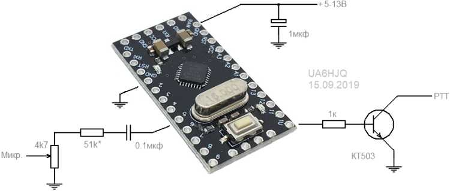

Это простой телеграфный маяк, например для репитера или других тестов.
При передаче мигает встроенным светодиодом. 

Текст задаётся в строке: sendMsg("R7HJ LN05XA");
Интервал передачи: #define PAUSE (600000UL)

Старая статья про [телеграфный маяк](http://kavkaz.qrz.ru/text/cw-beacon.html) кроме скетча, там всё верно написано.
